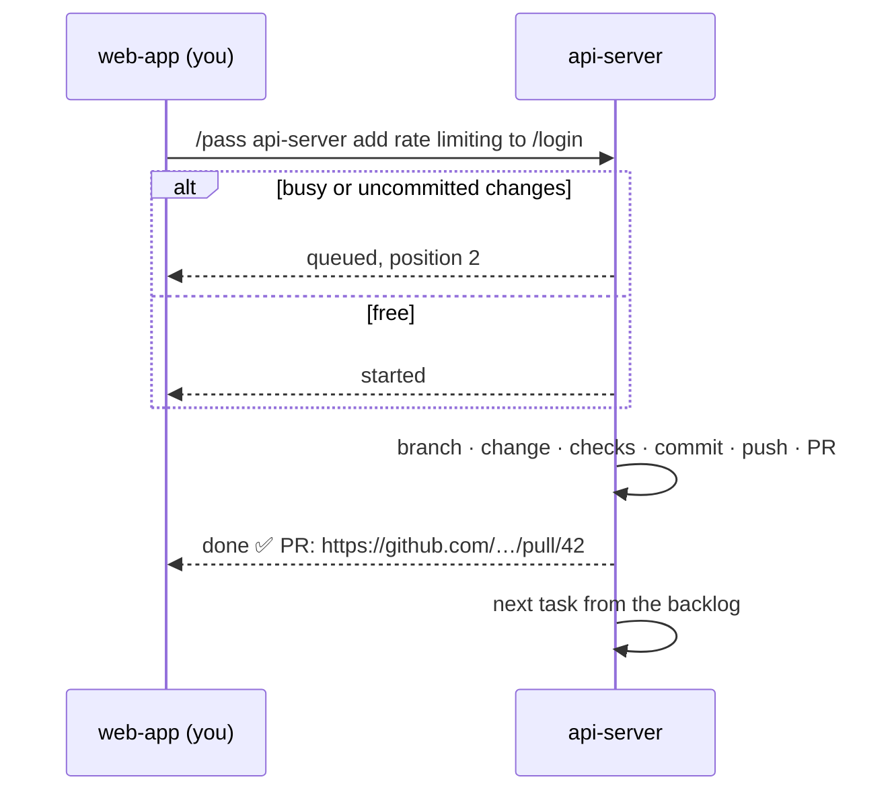

<div align="center">

# 🏃 baton

**Pass tasks between your Claude Code sessions.**

One session per repo. When work belongs somewhere else, hand it off and keep going.

[](plugins/baton/.claude-plugin/plugin.json)
[](https://claude.com/claude-code)
[](LICENSE)

</div>

```
/pass api-server add rate limiting to the /login endpoint
```

That's it. The `api-server` session picks it up, takes it to a pull request and tells you when it's done.

More ways to use it:

```
/pass web-app fix the dark mode toggle on the settings page
/pass infra raise the worker service's memory to 4 GB
/pass docs-site document the new /v2/orders endpoint
```

Or just ask Claude: *"pass this to web-app: the signup form should trim whitespace from emails"*.

## ✨ What the receiving session does

| | |
| --- | --- |
| 📥 **Queues it** | If it's already on a task or has uncommitted changes, the task waits in line and you hear your place. |
| 🔍 **Checks first** | If the change is already in place, it says so and changes nothing. |
| 🛠️ **Takes it to a PR** | Branches by your rule, makes the change, runs the repo's checks, commits, pushes, opens a pull request. |
| 📣 **Reports back** | Your session gets the outcome and the PR link. |
| ⏭️ **Picks up the next** | On its own, or when you run `/baton-next`. |

## 🔁 How a handoff flows



## 📊 The band

A band above the prompt shows where everything stands. Press a badge to expand it. In fullscreen, a side panel shows the details.

```
◆ web-app-3f   ◎ 3 (1 busy)   ▶ 1 ≡ 2   → 1/4
```

| Badge | Means |
| --- | --- |
| `◆ web-app-3f` | This session |
| `◎ 3 (1 busy)` | Other sessions, and how many are busy (claude-mem's observer sessions are hidden) |
| `▶ 1` | Tasks this session is working on |
| `≡ 2` | Tasks queued here |
| `→ 1/4` | Tasks you passed on: open / total |

## 🚀 Install

```sh
claude plugin marketplace add ashishsk93/baton-mods
claude plugin install baton@baton-mods
```

Needs Claude Code **v2.1.287** or later. Install it on every machine whose sessions should send or receive tasks.

## ⌨️ Commands

| Command | What it does |
| --- | --- |
| `/pass <session> <task>` | Pass a task to a session by its name in ListAgents. You can also just ask Claude to "pass this to …". |
| `/baton` | Show the task this session is working on and its backlog |
| `/baton-next [force]` | Pick up the next queued task; `force` drops a stuck one first |

## ⚙️ Configure

Set your branch naming rule in `/config` (**baton → Branch rule**). A repo's own instructions win when they name one.

Default:

> Branch off an up-to-date default branch as `<type>/<short-kebab-slug>`, type one of feat, fix, chore, refactor, perf, docs.

## 🔒 What it can do on your machine

baton is a mod: it runs inside Claude Code with your permissions. It:

- runs `git status` in the session's repo,
- submits prompts in the receiving session,
- sends messages between your own local sessions.

Run `claude plugin validate plugins/baton` to see the full list before you install it.

## 📄 License

[MIT](LICENSE) © 2026 Ashish S Kumar
