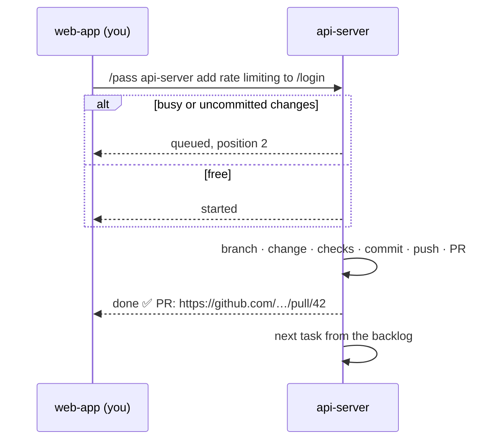

<div align="center">

# 🏃 baton

**Pass tasks between your Claude Code sessions.**

One session per repo. When work belongs somewhere else, hand it off and keep going.

[](plugins/baton/.claude-plugin/plugin.json)
[](https://claude.com/claude-code)
[](https://github.com/ashishsk93/baton-mods/actions/workflows/plugin-checks.yml)
[](LICENSE)

</div>

```
/pass api-server add rate limiting to the /login endpoint
```

That's it. The `api-server` session picks it up, takes it to a pull request and tells you when it's done.

More ways to use it:

```
/pass web-app fix the dark mode toggle on the settings page
/pass infra raise the worker service's memory to 4 GB
/pass docs-site document the new /v2/orders endpoint
```

Or just ask Claude: *"pass this to web-app: the signup form should trim whitespace from emails"*.

## ✨ What the receiving session does

| | |
| --- | --- |
| 📥 **Queues it** | If it's already on a task or has uncommitted changes, the task waits in line and you hear your place. With **Worktree** on, uncommitted changes don't hold it up. |
| 🔍 **Checks first** | If the change is already in place, it says so and changes nothing. |
| 🛠️ **Takes it to a PR** | Branches by your rule, makes the change, runs the repo's checks, commits, pushes, opens a pull request. |
| 📣 **Reports back** | Your session gets the outcome and the PR link. |
| ⏭️ **Picks up the next** | On its own, or when you run `/baton-next`. |

Got a change that spans repos? Pass it to several sessions at once, comma-separated:

```
/pass api-server,web-app,infra bump lodash to 4.17.21
```

Each session gets its own task. In the `→` panel they show as one group, `◇ 2/3 done  bump lodash`, with the members underneath.

If the receiving session hits something only you can answer, it asks instead of guessing. You get a toast and a `? waiting` row with the question. Reply with `/baton-answer <id> <answer>` and it carries on.

## ❓ Just ask

Not every question needs a PR. Ask another session about its repo and get the answer back here:

```
/ask api-server which env vars does the auth middleware read?
/ask infra what is the worker service's memory limit right now?
/ask web-app where do we format currency, and does it handle JPY?
```

The receiving session answers from its code, docs, config and git history. It changes nothing: no branch, no commit, no PR. Questions skip the task queue, so they get answered even while that session is busy with a task or has uncommitted changes. The answer arrives in your session as a message, and the `→` panel shows it under the question.

## 🔁 How a handoff flows



## 📊 The band

A band above the prompt shows where everything stands. Press a badge to expand it. In fullscreen, a side panel shows the details.

```
◆ web-app-3f   ◎ 3 (1 busy)   ▶ 1 ≡ 2   → 1/4
```

| Badge | Means |
| --- | --- |
| `◆ web-app-3f` | This session |
| `◎ 3 (1 busy)` | Other sessions, and how many are busy (claude-mem's observer sessions are hidden) |
| `▶ 1` | Tasks this session is working on |
| `≡ 2` | Tasks queued here |
| `→ 1/4` | Tasks you passed on: open / total, plus `(1 quiet)` when one has had no word for 2 hours |

Each task you passed on shows its state, how long since you last heard, and a clickable PR link once there is one:

```
✓ #k3x9p2 → api-server-7f  done 5m  add rate limiting to /login  PR #42
▶ #m1q8r4 → web-app-3f  started 12m  fix the dark mode toggle
○ #p7w2c1 → infra-a9  sent · no word in 3h  raise worker memory to 4 GB
```

| Icon | State |
| --- | --- |
| `○` / `?` | Sent (a task / a question), no reply yet; `?` also means waiting on your answer |
| `≡` | Queued behind other work |
| `▶` | Being worked on |
| `✓` | Done, already in place, or answered |
| `✗` | Blocked, dropped or cancelled |

A toast tells you as soon as a task finishes, gets stuck or has a question, so you don't have to watch the band. For GitHub PRs, baton follows the PR after "done" and adds `● CI running`, `✗ CI failing`, `✓ CI passing` or `✓ merged` to the row, checking every 5 minutes until it merges or closes. In the side panel, each queued task here has `↑` `↓` `✕` buttons to reorder the backlog or drop a task. Dropping one tells the sender.

## 🚀 Install

```sh
claude plugin marketplace add ashishsk93/baton-mods
claude plugin install baton@baton-mods
```

Needs Claude Code **v2.1.287** or later. Install it on every machine whose sessions should send or receive tasks.

## ⌨️ Commands

| Command | What it does |
| --- | --- |
| `/pass <session>[,<session>…] <task>` | Pass a task to a session by its name in ListAgents, or to several at once. You can also just ask Claude to "pass this to …". |
| `/ask <session> <question>` | Ask a session a question about its repo. It answers read-only and changes nothing. |
| `/baton` | Show the task this session is working on and its backlog |
| `/baton-next [force]` | Pick up the next queued task; `force` drops a stuck one first |
| `/baton-cancel <id>` | Take back a task you passed. The receiver drops it if it's still queued, and says so if it's already running. |
| `/baton-answer <id> <answer>` | Answer a question a receiving session asked about a task you passed |
| `/baton-report <id> <done\|already-done\|blocked> [PR URL] [summary]` | On the receiving side: send the real outcome of a task that already left the queue, e.g. one that was blocked and you then finished by hand |

## ⚙️ Configure

In `/config` → **baton**:

| Option | What it does |
| --- | --- |
| **Branch rule** | How the receiving session names the branch. A repo's own instructions win when they name one. |
| **Worktree** | Off by default. When on, each passed task is worked in its own `git worktree` next to the repo (`../<repo>-baton-<id>`), and the worktree is removed once the PR is open. Your uncommitted work stays untouched, and tasks no longer wait for a clean tree. The trade-off: a second checkout on disk while the task runs, and the session works outside its own folder. |
| **Hidden sessions** | A regular expression. Sessions whose names match are left out of the band and can't be passed to. The default, `^observer-sessions-`, hides claude-mem's background sessions. |

Session names don't need their suffix: `/pass infra …` goes to `infra-a9` when it's the only match. If a name is ambiguous or unknown, baton lists the near matches and sends nothing. It also refuses to pass a task to the session you're in.

The default branch rule:

> Branch off an up-to-date default branch as `<type>/<short-kebab-slug>`, type one of feat, fix, chore, refactor, perf, docs.

## 🔒 What it can do on your machine

baton is a mod: it runs inside Claude Code with your permissions. It:

- runs `git status` in the session's repo,
- runs `gh pr view` for GitHub PRs it follows (skipped quietly when `gh` isn't installed),
- submits prompts in the receiving session,
- sends messages between your own local sessions.

Run `claude plugin validate plugins/baton` to see the full list before you install it.

## 📝 Changelog

See [CHANGELOG.md](CHANGELOG.md).

## 📄 License

[MIT](LICENSE) © 2026 Ashish S Kumar
